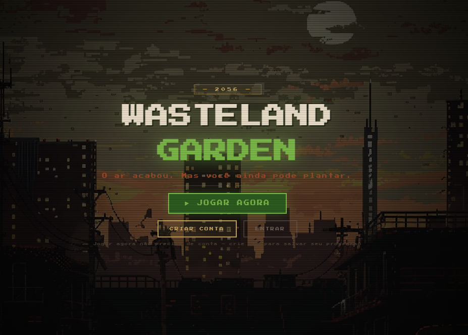
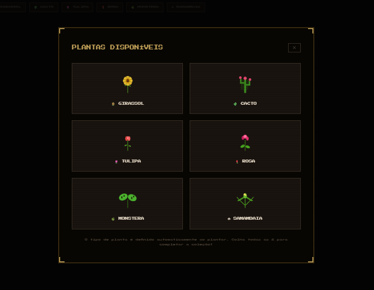

# 🌱 Wasteland Garden — Gerenciador de Tarefas em Pixel Art

Gerenciador de tarefas gamificado ambientado em 2056, num mundo pós-apocalíptico onde o ar é irrespirável. Cada tarefa é uma semente — você rega, espera crescer e colhe pra gerar oxigênio.


**[Acesse o jogo em produção →](https://pipe-stonks-frontend.vercel.app/)** — modo visitante disponível, não precisa criar conta

## Screenshots

| Tela inicial | Galeria de plantas |
|---|---|
|  |  |

## Sobre

A ideia veio de cansaço com gerenciadores de tarefa convencionais. Trello, Todoist, Notion — todos funcionam, mas nenhum me dava vontade de abrir. Queria algo que transformasse o ato de marcar uma tarefa como concluída em algo visualmente recompensador, no estilo dos jogos de farming que eu jogava muito (Stardew Valley, Forager).

Cada tarefa criada vira uma semente plantada num dos 6 vasos do canteiro. Ela passa por 5 estágios (SEMENTE → BROTO → MUDA → ÁRVORE → FRUTO) ao longo de 7 dias. Você precisa regar a cada 12h pra ela evoluir — se passar 24h sem regar, a planta morre e desconta O₂. Quando chega no estágio FRUTO, você colhe e ganha +20 de O₂ no seu indicador pessoal. Tem 6 tipos de planta (girassol, cacto, tulipa, rosa, monstera, samambaia), cada uma com sprite próprio desenhado em SVG inline.

## Por que fiz

Gosto muito de pixel art e há um tempo queria fazer um jogo de gerenciamento de estufa nesse estilo — algo que fugisse do tom limpo e corporativo dos gerenciadores de tarefa que eu uso no dia a dia. Aproveitei o projeto também pra aprender a parte de testes automatizados a sério (unit com Vitest e E2E com Playwright), que era a área que eu tinha menos prática.

## Funcionalidades

* Introdução narrativa contando a história de 2056 antes de entrar no jardim
* 6 vasos no canteiro com tipos de planta fixos por slot
* Sistema de estágios baseado em tempo real (dias desde o plantio)
* Cooldown de 12h pra regar — força engajamento diário
* Plantas morrem se ficarem 24h sem água, descontando O₂
* Indicador de O₂ pessoal que sobe com colheitas e cai com plantas mortas
* Modo visitante via `localStorage` (sem precisar criar conta)
* Cadastro/login com JWT
* Página de histórico (Estufa) com timeline mensal, filtro por tipo de planta e galeria de todas as plantas colhíveis
* Animações pixel art ambientes: chuva ácida, poeira flutuando, flash de evolução
* Toast notifications de pixel art ao plantar, regar e colher
* Responsivo — funciona no celular com grid adaptado
* Tutorial inicial pra quem nunca usou (reabrível a qualquer momento)

## Stack

* **Frontend:** React 18 + Vite + TypeScript + Zustand + React Query + React Router
* **Backend:** Node.js + Fastify + Prisma ORM + Zod + JWT
* **Banco:** PostgreSQL hospedado na Neon
* **Testes:** Vitest (unit) + Testing Library (componentes) + Playwright (E2E)
* **Deploy:** Vercel (frontend + backend serverless)

## Arquitetura

```
PipeStonks/
├── frontend/
│   ├── src/
│   │   ├── pages/           # LandingPage, IntroPage, LoginPage, DashboardPage, HistoryPage
│   │   ├── components/game/ # OxygenBar, PixelPlant, PixelCharacter
│   │   ├── store/           # Zustand: auth (persist), visitor (persist)
│   │   ├── lib/             # api.ts (axios + interceptor JWT)
│   │   ├── __tests__/       # Vitest + Testing Library
│   │   └── index.css        # Variáveis pixel art + keyframes
│   ├── e2e/                 # Playwright specs
│   └── playwright.config.ts
└── backend/
    ├── src/
    │   ├── routes/          # auth, tasks, categories, history
    │   ├── schemas/         # Zod + funções puras (canWater, daysToStage, isDead)
    │   ├── middleware/      # authenticate (JWT)
    │   ├── app.ts            # monta o Fastify (usado local e na Vercel)
    │   └── server.ts        # boot local (listen)
    ├── api/index.ts          # handler serverless pra Vercel
    ├── prisma/schema.prisma # User, Task, Category, History
    └── vitest.config.ts
```

Frontend e backend são apps separados (monorepo simples, sem turborepo). Localmente o frontend roda em `localhost:5173` e o backend em `localhost:3333`. Em produção os dois viram projetos separados na Vercel — o backend roda como função serverless (`api/index.ts` chama o mesmo `buildApp()` usado no `server.ts` local). A comunicação é via axios com interceptor que injeta o JWT do Zustand persist.

O modo visitante é interessante: ao invés de bater na API, todas as operações de planta/rega/colheita são interceptadas no `DashboardPage` e roteadas pro `visitorStore` (também Zustand persist no `localStorage`). Isso permite a pessoa testar o jogo inteiro sem nem precisar criar conta — e quando ela cria, o estado anterior é descartado.

## Rodando localmente

Pré-requisitos: Node.js 18+, PostgreSQL local ou Neon.

```bash
# 1. Clonar
git clone https://github.com/Pedroaruana/PipeStonks.git
cd PipeStonks

# 2. Backend
cd backend
npm install
cp .env.example .env   # preencher DATABASE_URL, JWT_SECRET
npx prisma migrate dev
npm run dev            # localhost:3333

# 3. Frontend (em outro terminal)
cd frontend
npm install
npm run dev            # localhost:5173
```

Testes:

```bash
cd backend  && npm test            # vitest unit
cd frontend && npm test            # vitest + testing library
cd frontend && npm run test:e2e    # playwright
```

## Desafios

**Testes E2E com Playwright** — foi o que mais me travou. A primeira rodada deu 10 falhas em 10 testes, e cada uma era de um motivo diferente: tutorial modal bloqueando cliques (resolvi setando `localStorage` num `addInitScript`), seletores errados porque chutei os textos sem ler, e um timeout estranho que descobri ser **outro projeto local rodando na porta 5173** — o `webServer` do Playwright conectava nele em vez de subir o meu. Troquei pra `--port 5174` e funcionou. Perdi 3h num teste que era trivial no fim.

**Modo visitante vs autenticado** — usei `isVisitor` (que dependia de `?visitor=true` na URL) ao invés de `!user`, então quem entrava direto em `/garden` ficava num limbo sem conseguir plantar. Troca de uma linha que levou um tempo pra eu identificar.

**Pixel art em SVG inline** — recusei sprite sheets pra não depender de asset externo. Cada planta é um SVG com `<rect>`s formando os pixels. Funciona bem, mas dá arquivo grande.

**Deploy do backend** — queria fugir de plataformas que pedem cartão até pra usar o plano grátis. Acabei adaptando o Fastify pra rodar como função serverless na Vercel (`api/index.ts` reaproveitando o mesmo `buildApp()` do servidor local), que resolveu sem custo nenhum.

---

Feito por Pedro Aruana — [github.com/Pedroaruana](https://github.com/Pedroaruana)

MIT License © 2026
